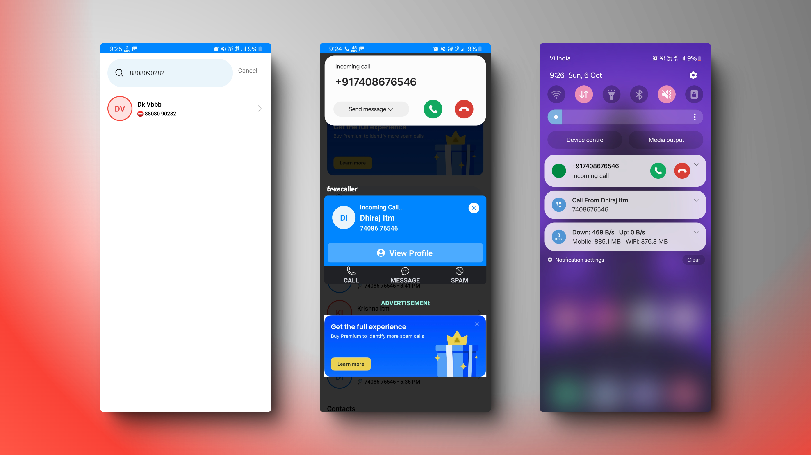
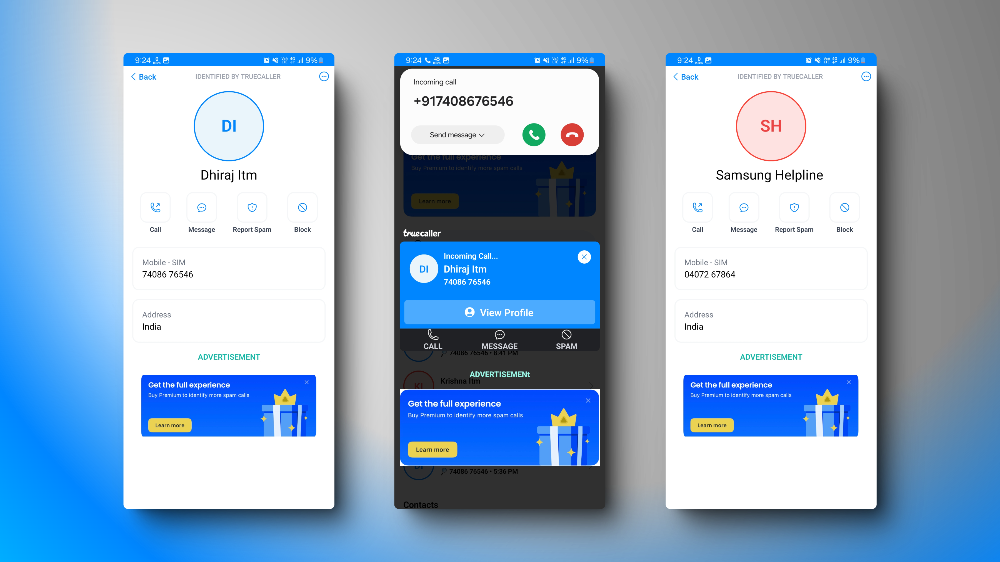
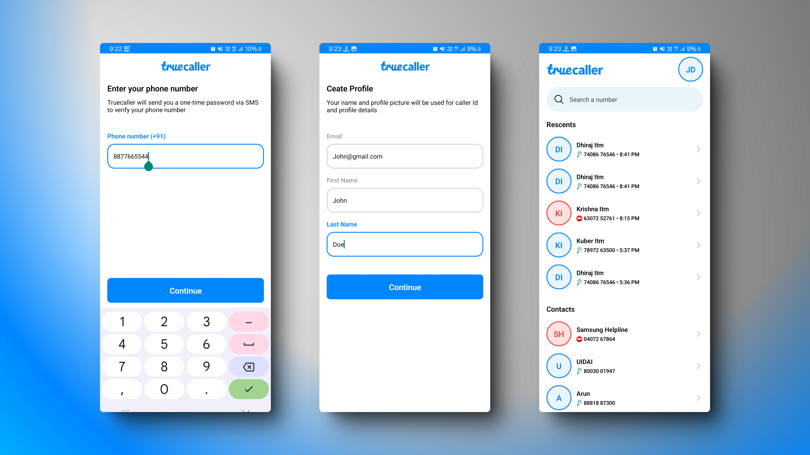

# Truecaller Clone - Full Stack React Native | Node.js Backend

## Showcase Screenshots

---

This **Truecaller clone** project exemplifies the advanced integration of React Native with Kotlin native modules, demonstrating a high level of proficiency in mobile app development. The application is engineered to detect incoming calls, display caller IDs, and screen spam calls, making it a comprehensive hands-on learning project with robust call detection and spam filtering mechanisms.

## Key Achievements

- **Seamless Call Detection**: Implemented real-time notifications for both incoming and outgoing calls, ensuring users are always informed.
- **Advanced Caller ID & Spam Detection**: Developed a system to identify caller details and screen for spam numbers, enhancing user security.
- **Innovative Kill Mode**: Activated headless JS tasks to run background processes, significantly improving performance and call handling capabilities.
- **Efficient React Native & Kotlin Bridge**: Leveraged Kotlin for Android-specific functionalities, achieving seamless integration with React Native.
- **Enhanced Push Notifications**: Utilized **Notifee** to deliver advanced push notifications during call events, improving user engagement.
- **Robust State Management**: Employed **Zustand** for efficient state management, ensuring smooth app performance.

## Tech Stack

- **React Native CLI**: Utilized for building the app with native Android functionalities.
- **Kotlin Native Modules**: Integrated Android-specific features using Kotlin, showcasing expertise in native module development.
- **Node.js & MongoDB**: Developed a backend API for managing and storing user data, demonstrating full-stack development skills.
- **Zustand**: Implemented lightweight state management for React Native, ensuring efficient state handling.
- **Call Detection & Screening**: Used SDK Call Kotlin for monitoring incoming calls, highlighting proficiency in call management.
- **Notifee**: Integrated advanced notifications for call and spam alerts, enhancing user experience.
- **Headless JS**: Enabled background processing for Kill Mode, showcasing advanced JavaScript capabilities.

## Usage

- Upon launch, the app actively listens for incoming and outgoing calls.
- Displays detailed caller information and flags spam calls based on the number’s reputation.
- Utilizes the "Kill Mode" for advanced call screening and background task execution, ensuring optimal performance.

